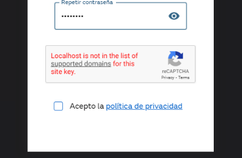

# reCAPTCHA key upgrade

## Issue
"Localhost is not in the list of supported domains for this site key"

see screenshot below



## Solution applied
(Temporarily) replace the site key with a new one that includes localhost.

Details:

While creating a new site key in the google console (type "I am human" checkbox, v2), I added to the list of allowed domains:
- areaprivada.ufd.es
- localhost

Reminder: 
- iOS apps are served locally from `capacitor://localhost` origin
- Android apps are served locally from `http://localhost` origin

The new site key is `6LcJ5MgkAAAAAL7TLH19yfJKqOI77HPtB59KStG5`

This new key replaced the previous one in `src/.env.production`

diff:


```diff
- REACT_APP_CAPTCHA_PUBLIC_KEY=6Lc9ck4UAAAAALdHcA9w_Bfp8WRDyowLLp-R3_SP
+ REACT_APP_CAPTCHA_PUBLIC_KEY=6LcJ5MgkAAAAAL7TLH19yfJKqOI77HPtB59KStG5
```

It is up to the mantainers to decide but we suggest to keep the old key and edit its settings in 
https://www.google.com/recaptcha/admin to include localhost in the list of allowed domains. 
This way stats are not lost.